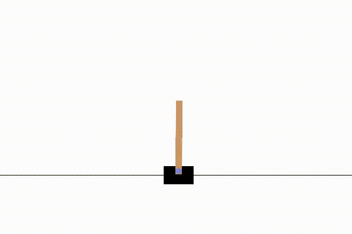
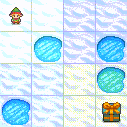

# NS-Gym: A Comprehensive and Open-Source Simulation Framework for Non-Stationary Markov Decision Processes

**NS-Gym** (Non-Stationary Gym) is a flexible framework providing a standardized abstraction for both modeling Non-Stationary Markov Decision Processes (NS-MDPs) and the key problem types that a decision-making entity may encounter in such environments.

Built on top of the popular Gymnasium library, NS-Gym provides a set of wrappers for existing environments, making it easy to incorporate non-stationary dynamics and manage the nature of agent-environment interaction specific to NS-MDPs.

A key feature of NS-Gym is emulating the core problem types of decision-making in non-stationary settings; these problem types concern not only the ability to adapt to changes in the environment but also the ability to detect and characterize these changes. 

We currently support the Gymnasium classic control suite of environments, MuJoCo environments, and stochastic environments like FrozenLake. NS-Gym is designed to be easily extensible, allowing users to create their own non-stationary environments by defining parameter change schedules and update functions. We welcome contributions from the community to expand the library of non-stationary environments and algorithms!

---

## Project Webpage and Documentation

Visit our project webpage for tutorials, core concepts, and documentation: [nsgym.io](https://nsgym.io) 

---

## Installation

To install NS-Gym, you can use `pip`. uv is recommended but not required (replace `uv pip` with `pip` if you don't use uv):

```bash
uv pip install ns-gym
```

You can also install the latest development version directly from the GitHub repository:

```bash
uv pip install git+https://github.com/scope-lab-vu/ns_gym
```

We'll eventually release NS-Gym on PyPI for easier installation.

-----

## White Paper

**NS-Gym: Open-Source Simulation Environments and Benchmarks for Non-Stationary Markov Decision Processes**

[Read our paper published in NeurIPS 2025 Dataset and Benchmarks track](https://openreview.net/pdf?id=YOXZuRy40U). See tag `submission/ns_gymv0` for benchmarking code used in the paper.

### Citation

```bibtex
@inproceedings{
keplinger2025nsgym,
title={{NS}-Gym: A Comprehensive and Open-Source Simulation Framework for Non-Stationary Markov Decision Processes},
author={Nathaniel S Keplinger and Baiting Luo and Yunuo Zhang and Kyle Hollins Wray and Aron Laszka and Abhishek Dubey and Ayan Mukhopadhyay},
booktitle={The Thirty-ninth Annual Conference on Neural Information Processing Systems Datasets and Benchmarks Track},
year={2025},
url={https://openreview.net/forum?id=YOXZuRy40U}
}
```

-----

## Decision Making Algorithm Support

NS-Gym is designed to be compatible with existing reinforcement learning libraries such as [Stable Baselines3](https://stable-baselines3.readthedocs.io/en/master/). Additionally, NS-Gym provides baseline algorithms designed explicitly for non-stationary environments, as well as a leaderboard to compare algorithm performance on various non-stationary tasks.

-----

##  NS-Gym in Action

Here are three examples of non-stationary environments created using NS-Gym. Each demonstrates a transition from an initial MDP ($\mathcal{MDP}_0$) to a modified MDP ($\mathcal{MDP}_1$) by changing environment parameters ($\theta_0 \rightsquigarrow \theta_1$).

| Stationary MDP | Change Type | Non-Stationary MDP |
| :---: | :---: | :---: |
| **CartPole:** Stationary MDP | **At timestep $t$ gravity massively increases according to a user-defined step function.** | **CartPole:** Non-Stationary MDP |
|  | $\Large \theta_0 \rightsquigarrow \theta_1$ |  |
| **FrozenLake:** Stationary MDP | **Probability of moving in the intended direction goes to 0 just before reaching the goal.** | **FrozenLake:** Non-Stationary MDP |
|  | $\Large \theta_0 \rightsquigarrow \theta_1$ |  |
| **Ant:** Stationary MDP | **Magnitude of gravity gradually decreases at each timestep following a geometric progression.** | **Ant:** Non-Stationary MDP |
|  | $\Large \theta_0 \rightsquigarrow \theta_1$ |  |

*Note: This type of parameter shift is just one example of how an NS-MDP can be implemented. The policies controlling the agents are detailed in the full documentation.*

------


# Quickstart
Suppose we want to model a non-stationary environment in the classical CartPole environment, where the pole’s mass increases by 0.1 units at each time step, and the system’s gravity increases through a random walk every three time steps. NS-Gym let's us emulate "runtime" monitors tha can detect changes in the environment (but not the magnitude of the changes) and a "model updater" the tells us the magnitude of the changes. In this case we simple want the decision making entity to be notified that there has been a change in the environment but not know to what extent. The corresponds to the decision-making agent to having a "basic notification level". The following code snippet shows the general experimental setup in this CartPole Gymnasium environment using NS-Gym.

```python

###### Step 1: Import necessary gym and ns_gym modules
import gymnasium as gym
import ns_gym
from ns_gym.wrappers import NSClassicControlWrapper
from ns_gym.schedulers import ContinuousScheduler, PeriodicScheduler
from ns_gym.update_functions import RandomWalk, IncrementUpdate
from ns_gym.benchmark_algorithms import MCTS


###### Step 2: Create a standard gym environment ####
env = gym.make("CartPole-v1")
#############

########## Step 3: to describe the evolution of the non-stationary parameters, 
# we define the two schedulers and update functions that model the semi-Markov chain over the relevant parameters
############
scheduler_1 = ContinuousScheduler()
scheduler_2 = PeriodicScheduler(period=3)

update_function1= IncrementUpdate(scheduler_1, k=0.1)
update_function2 = RandomWalk(scheduler_2)

##### Step 4: map parameters to update functions
tunable_params = {"masspole":update_function1, "gravity": update_function2}

######## Step 5: set notification level and pass environment and parameters into wrapper
ns_env = NSClassicControlWrapper(env,tunable_params,change_notification=True)

######### Step 6: set up ns-environment and agent interaction loop. i.e ... 
done = False
truncated = False

episode_reward = 0

obs,info = ns_env.reset()

planning_env = ns_env.get_planning_env()
mcst_agent = MCTS(planning_env, state=obs["state"], d=50, m=100,c=1.4,gamma=0.99)
done = False
truncated = False

timestep = 0
while not (done or truncated):
    action = mcst_agent.act(obs,planning_env)
    obs, reward, done, truncated, info = ns_env.step(action)


    if timestep % 10 == 0:
        print("Timestep: ", timestep)
        print("obs: ", obs)
        print("reward: ", reward)   
        print("########")
        print("\n")
    planning_env = ns_env.get_planning_env()
    episode_reward += reward.reward
    timestep += 1

print("Episode Reward: ", episode_reward)
```

If we run this code snippet the environment obversvation and reward at timestep 0 may look like this:

```python
Timestep:  0

obs:  {'state': array([-0.03006991,  0.19717823,  0.02711801, -0.3215324 ], dtype=float32), 
        'env_change': {'masspole': 1, 'gravity': 1}, 
        'delta_change': {'masspole': 0.0, 'gravity': 0.0}, 
        'relative_time': 1}

reward:  Reward(reward=1.0, 
                env_change={'masspole': 1, 'gravity': 1}, 
                delta_change={'masspole': 0.0, 'gravity': 0.0}, 
                relative_time=1)

```

The `obs` dictionary of the following terms:

- `state`: the standard Gymnasium observation of the environment.
- `env_change`: a dictionary indicating whether this parameter has changed (1 indicates a change, 0 indicates no change). This is only available if `change_notification=True` is set in the wrapper.
- `delta_change`: a dictionary indicating the magnitude of change for each parameter. This is only available if `delta_change_notification=True` is set in the wrapper. Defaults to zero if not set.
- `relative_time`: Current time step of environment.

The `reward` object is a data class rather than a dictionary that contains the same terms. While the observation is a dictionary to maintain compatibility with Gymnasium, the reward is a dataclass to allow for easier extension in the future for non-stationary rewards while working with a more robust data structure.

# Tutorial:

A more comprehensive tutorial can be found [here](tutorial.ipynb)

# Development and testing

We welcome any contributions to this NS-Gym project! If you find a bug or want to add a new feature, please feel free to open an issue or submit a pull request.

Fork then clone the repository, install the required dependencies in editable mode, and run the tests to ensure everything is working correctly. We use UV for package management. 

```bash
git clone https://github.com/scope-lab-vu/ns_gym.git
cd ns_gym
uv pip install -e ".[all]" --force-reinstall
```

To run all test in the project run: 

```bash
pytest tests/
```

After forking the repo make a new branch for your feature or bugfix (e.g, `git checkout -b feature/new-non-stationary-env`), commit your changes, and push the branch to your fork. Then, open a pull request against the main repository's `main` branch.


To run tox tests to test against multiple Python versions, navigate to the root directory of the project and run:

```bash
tox 
```

To versioning is handled via `setuptools_scm`. When we tag a new release, the version number will be automatically updated based on the latest tag. 