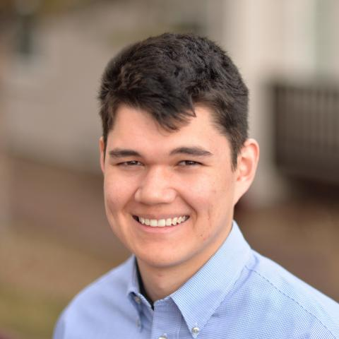

<table style="width:100%; border:none;">
  <tr style="border:none;">
    <td style="border:none; vertical-align:top;">
      <h1 style="margin-top:0;">
        AAMAS 2026 Competition:<br>
        Evaluating Adaptive Decision Agents<br>
        under Non-Stationarity
      </h1>
    </td>
    <td style="border:none; width:240px; vertical-align:top; text-align:right;">
      
    </td>
  </tr>
</table>

## AAMAS 2026 Competition
Welcome to the AAMAS 2026 Non-Stationarity Challenge Page! This competition, co-located with [AAMAS 2026](https://cyprusconferences.org/aamas2026/), invites researchers and practitioners to develop and evaluate decision-making agents that can effectively adapt to non-stationary environments using the NS-Gym framework. Participants will design agents capable of detecting, adapting to, and recovering from dynamic environmental shifts. The solution method is open to any approach, including but not limited to reinforcement learning, online planning, meta-learning, and continuous learning. The competition aims to foster innovation in adaptive decision-making and provide insights into the challenges of non-stationary environments. Results will be presented at the AAMAS 2026 conference.

If you are interested in participating and would like to be directly notified of updates, please fill out this [interest form](https://forms.cloud.microsoft/Pages/ResponsePage.aspx?id=OX9aur7js0q0UGf6gPrsrbmt9pQGce1EtA3Q_nZfuDxUQUczRDJEWkdWV0YwNUpLTk5PTkhHNzdVMS4u).

Additional details regarding specific environments, evaluation protocols, and submission guidelines will be provided as the submission portal opening date approaches.


*Graphic Generated by Gemini Nano Banana Pro*

### About AAMAS 2026
The [25th International Conference on Autonomous Agents and Multiagent Systems (AAMAS 2026)](https://cyprusconferences.org/aamas2026/) will be held 25–29 May 2026 in Paphos, Cyprus.

AAMAS is the largest and most influential conference in the field of agents and multi-agent systems, bringing together researchers and practitioners across all areas of agent technology and providing an internationally renowned, high-profile forum for publishing and discovering the latest developments in the field. AAMAS is the flagship conference of the non-profit [International Foundation for Autonomous Agents and Multiagent Systems (IFAAMAS)](https://www.ifaamas.org/). You can view a list of past AAMAS conferences [here](https://www.ifaamas.org/previousaamas.html).

### Important Dates

All times are AOE.

- **January 30, 2026**: Baseline Competition Code Release and Submission Portal Opens
- **January - April 2026**: Submission period with open leaderboard and Q&A forum
- **April 30, 2026**: Final Submission Deadline
- **May 25-29, 2026**: AAMAS 2026 Conference (Paphos, Cyprus) and presentation of competition results

### NS-Gym NeurIPS Paper

For more information about NS-Gym and the underlying framework for this competition, please refer to our NeurIPS 2025 paper: [NS-Gym: A Comprehensive and Open-Source Simulation Framework for Non-Stationary Markov Decision Processes](https://openreview.net/pdf?id=YOXZuRy40U).

```bibtex
@inproceedings{
    keplinger2025nsgym,
    title={{NS}-Gym: A Comprehensive and Open-Source Simulation Framework for Non-Stationary Markov Decision Processes},
    author={Nathaniel S Keplinger and Baiting Luo and Yunuo Zhang and Kyle Hollins Wray and Aron Laszka and Abhishek Dubey and Ayan Mukhopadhyay},
    booktitle={The Thirty-ninth Annual Conference on Neural Information Processing Systems Datasets and Benchmarks Track},
    year={2025},
    url={https://openreview.net/forum?id=YOXZuRy40U}
}
```

### NS-Gym Installation

To get started with NS-Gym, please follow the instructions in the NS-Gym [quickstart guide](quickstart_guide.md) to install the package and set up your development environment. A tutoiral notebook for using NS-Gym can be found [here](https://github.com/scope-lab-vu/ns_gym/blob/main/tutorial.ipynb)

### Submission Guidelines

Submissions will be fielded through GitHub. Detailed instructions will be provided on the competition website closer to the open submission period in late January 2026.

To ensure fairness and prevent code leakage, we will use a private repository model. We will provide an `ns-gym-comp-template` repository that contains instructions, evaluation code, and other boilerplate code to get started. Participants will clone this repository as a private repository and implement their agents. The boilerplate code will provide a standard interface for submitting agents and evaluating them on the competition environments.

#### Agent Interface
- Model-free agents must expose a `select_action(obs)` method.
- Model-based agents must expose a `select_action(obs, planning_env)` method, where `planning_env` is a stationary snapshot of the environment provided by NS-Gym that can be used for planning.

### Evaluation Criteria

We evaluate agents based on how well they handle the transition from a stable environment to a changed one. The scoring is aggregated across multiple environments using normalized metrics.

1. **Adaptability**: We measure the speed and effectiveness of adaptation after a change occurs. This includes the number of new environment interactions (timesteps) required and the total runtime before the agent is considered recovered.
2. **Performance**: This is calculated based on the average undiscounted episodic reward achieved under non-stationary conditions.
3. **Resilience**: We assess how well the agent recovers from unexpected shifts in dynamics. We specifically look at the magnitude of the performance drop between the stable pre-shift return and the post-shift episode return.
4. **Efficiency**: We track the computational cost of the adaptation mechanism. This includes CPU/GPU utilization per decision step and the total memory utilization across the evaluation episode.

### Example Environments

The competition will focus on environments that have parametric changes. The parametric changes involve gradual or abrupt variations in continuous parameters that affect the environment's dynamics. Examples include changes in friction coefficients, mass distributions, or gravity. The magnitude and frequency of these changes will vary across different environments to test the robustness of the agents.

We will evaluate all submitted agents on a suite of non-stationary environments using NS-Gym. For each environment in NS-Gym, we will define a holdout set of non-stationary variations for testing not available to the public. Each variation will define a set of parameters to change, frequency of changes, and the magnitude of changes. For each environment we will test agents on three levels of "notification" settings

- **Basic Notification**: The agent is only informed that a change has occurred but receives no additional context.
- **Detailed Notification**: The agent is explicitly informed when a change occurs and will receive additional context about the nature of the change.
- **Uninformed**: The agent is not informed of any changes.

### Contact Information

Please feel free to reach out with any questions or concerns regarding the competition. You can contact the competition organizers at **nathaniel.s.keplinger** [at] **vanderbilt.edu** and **ayan.mukhopadhyay** [at] **vanderbilt.edu**


<hr>

<h2 style="text-align:center;">Competition Organizers</h2>

<div style="
  display: flex;
  justify-content: center;
  gap: 40px;
  flex-wrap: wrap;
  margin-top: 30px;
">

  <!-- Organizer 1 -->
  <div style="text-align: center; max-width: 160px;">
    
    <div style="font-weight: 600;">Nathaniel S. Keplinger</div>
    <div style="font-size: 0.9em; color: #555;">Graduate Student, Vanderbilt University</div>
    <a href="https://nkepling.github.io" target="_blank" style="font-size: 0.9em;">
      Website
    </a>
  </div>

  <!-- Organizer 2 -->
  <div style="text-align: center; max-width: 160px;">
    
    <div style="font-weight: 600;">Ayan Mukhopadhyay</div>
    <div style="font-size: 0.9em; color: #555;">Assistant Professor, College of William and Mary</div>
    <a href="https://www.ayanmukhopadhyay.com/" target="_blank" style="font-size: 0.9em;">
      Website
    </a>
  </div>

  <!-- Organizer 3 -->
  <div style="text-align: center; max-width: 160px;">
    
    <div style="font-weight: 600;">Abhishek Dubey</div>
    <div style="font-size: 0.9em; color: #555;">Associate Professor, Vanderbilt University</div>
    <a href="https://abhishekdubey.bio/" target="_blank" style="font-size: 0.9em;">
      Website
    </a>
  </div>

  <!-- Organizer 4 -->
  <div style="text-align: center; max-width: 160px;">
    
    <div style="font-weight: 600;">Aron Laszka</div>
    <div style="font-size: 0.9em; color: #555;">Assistant Professor, Pennsylvania State University</div>
    <a href="https://aronlaszka.com/" target="_blank" style="font-size: 0.9em;">
      Website
    </a>
  </div>

</div>
