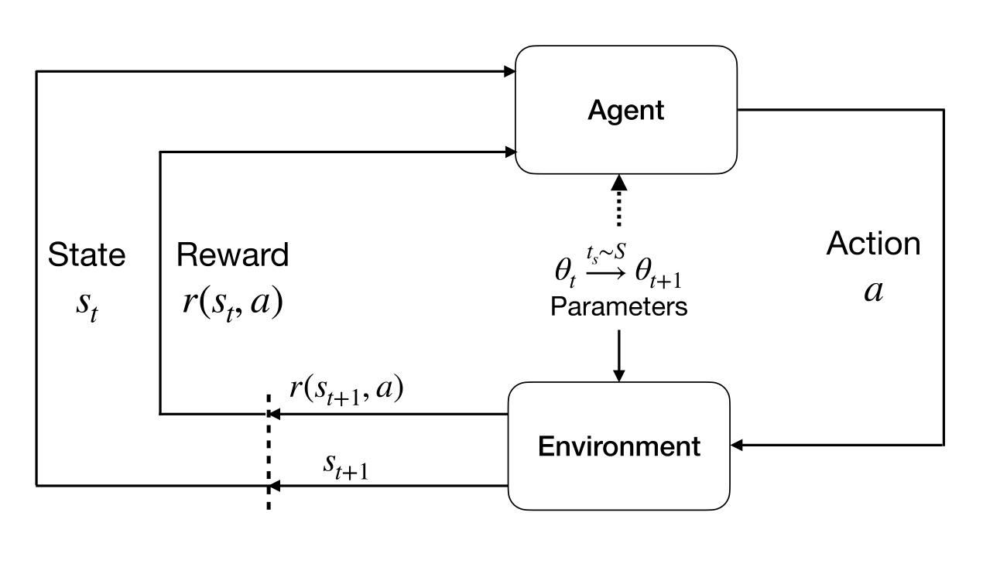
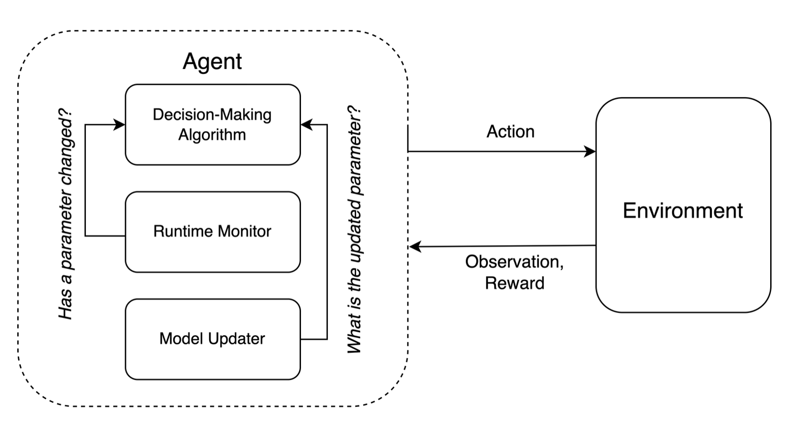

Core Concepts
==================================================
The following sections provide an overview of the core concepts and theory informing the design of NS-Gym. The goal of NS-Gym is to provide a flexible framework for modeling non-stationary Markov decision processes and capture the key aspects of decision making in non-stationary environments. For an even deeper dive into the theory and concepts behind NS-Gym, please refer to our `ArXiv paper <https://arxiv.org/pdf/2501.09646>`_.

.. admonition:: TLDR
    
    - We model non-stationary MDPs as an underlying "base MDP" which captures the core stochastic control process. We then model the evolution of environmental parameters affecting the transition dynamics as a semi-Markov chain that is exogenous to the base MDP.
  
    - Decision making in non-stationary environments comes down to four key questions: (1) What changes in the environment? (2) How does the environment change? (3) Does the agent detect the change (though not necessarily what or how)? (4) Does the agent know the change? NS-Gym provides the interface to model these different problem types.

    - NS-Gym provides the interface to emulate either or both a runtime monitor and model updater which we argue are common components in non-stationarity decision-making. We thereby focus the development toward the core decision-making module.

A Some Background on MDPs
-----------------------------------------------

Many real-world problems involve agents making sequential decisions over time under sources of uncertainty. Here we refer to an *agent* as an entity capable of computation that *acts* based on *observations* from the environment. We can categorize sources of uncertainty into two categories:

1) *Endogenous uncertainty*: This refers to uncertainty that arises from the agent's own actions and decisions. For example, in a game of chess, the outcome of a move is uncertain because it depends on the opponent's response.

2) *Exogenous uncertainty*: This refers to uncertainty that arises from factors outside the agent's control. For example, in a stock trading scenario, the future price of a stock is uncertain because it depends on market conditions and other external factors.

A popular framework for modeling sequential decisions under uncertainty is the Markov Decision Process (MDP). An MDP is defined by the tuple :math:`(\mathcal{S}, \mathcal{A}, P(s'\mid s,a,\theta), \mathcal{R})` where:

- :math:`\mathcal{S}`: This element summarizes our current “position” in the world or the current conditions of the system that we are interested in.
- :math:`\mathcal{A}`: The set of choices that the agent has access to. Note that all actions might not be available in all states.
- :math:`P(s'\mid s,a,\theta)`: A probability distribution over the future state given current state and action and :math:`\theta \in \Theta` denotes the set of observable environmental parameters. i.e :math:`P(s' \mid s,a,\theta)`
- :math:`\mathcal{R}`: The reward function :math:`R(s,a,s')` quantifies the instantaneous reward the agent gets by being in state :math:`s` taking action :math:`a` and transitioning to state :math:`s'`.

Importantly the cannonical MDP only captures problem instances with soley endogenous uncertainty. This is because the transition function is assumed to be stationary, i.e. it does not change over time. To capture exogenous uncertainty, we need to extend the MDP framework to allow for non-stationary transition dynamics.

.. figure:: _static/images/mdp.png
    :align: center
    :alt: A diagram illustrating a stationary MDP.
    :width: 80%

    Figure 1: The agent-environment interaction in a stationary MDP.

Non-Stationary Environments
------------------------------------------------

In the literature of decision making under uncertainty there have been several conceptualizations of non-stationary environments. In our framework we are inspired by the seminal work of `Campo, Mookerjee, & Bar-Shalom, 1991 <https://ieeexplore.ieee.org/stamp/stamp.jsp?arnumber=67304>`_ who explicitly disentangle Markovian model uncertainties from the evolution of environmental parameters :math:`\theta \in \Theta` that govern the transition dynamics.

NS-Gym defines a "base MDP" to model the underlying stochastic control process. The evolution :math:`\theta_t` is modeled as a semi-Markov chain that is exogenous to the base MDP. This conceptualization allows
us to capture a wide range of non-stationarity.

    Figure 2: The agent-environment interaction in a stationary NS-MDP. Here we see the evolution of environmental parameters :math:`\theta_t` as a semi-Markov chain that is exogenous to the base MDP.

Mathematically, we let :math:`\theta` denote the set of observable environmental variables that govern the transition dynamics of the base MDP. This notation, following `Campo, Mookerjee, & Bar-Shalom, 1991 <https://ieeexplore.ieee.org/stamp/stamp.jsp?arnumber=67304>`_, clearly segregates the evolution of environmental parameters that characterize non-stationarity from the agent's decision makign module. By design, the evolution of :math:`\theta` is left to the end user; it is completely configurable for a diverse set of non-stationary scenarios. At a high level, NS-Gym defines

1) A transition function :math:`P(s' \mid s,a,\theta_t)` that defines the probability of transitioning to state :math:`s'` given current state :math:`s`, action :math:`a`, and environmental parameters :math:`\theta_t` at time :math:`t`.
2) A function :math:`f(t)` i.e :math:`\theta_{t+1} = f(\theta_t,t)` that defines how the environmental parameters evolve over time.

In the NS-Gym framework, we implement :math:`f(t)` as the "schedulers" which determine when updates occur and "parameter update functions", which determine how :math:`\theta` changes. 

Decision Making in Non-Stationary Environments
-----------------------------------------------------

In designing NS-Gym, we deliberately keep the definition of what constitutes an "agent" as broad as possible as the definition of what constitutes an "agent" has been in flux. However motivated by how many decision-making agents are implemented in practice, we argue that decision-making infrastructures in non-stationary environments can be sufficiently described by three key components: the core decision-making module, a runtime monitor, and a model updater. We do not necessarily assume that every agent designed for decision-making in non-stationary environments necessarily be integrated with all three components and could instead simply assume their existence implicitly.

    Figure 3: The decision-making infrastructure for non-stationary environments.

With this agentic perspective in mind, NS-Gym provides the interface to emulate either or both a runtime monitor and model updater, thereby focusing the development toward the core decision-making module.

Furthermore, given these decision-making components, we can can categorize decision-making in non-stationary environments as seen in the literature (`see our ArXiv paper <https://arxiv.org/pdf/2501.09646>`_) by answering four key questions:

1) What changes in the environment? 
2) How does the environment change?
3) Does the agent detect the change (though not necessarily what or how)?
4) Does the agent know the change?

From these questions, we can distill the key problem types that arise in non-stationary environments:

1) Agent knows that the environment has changed (:math:`\theta_1` no longer applies) but does now know to what extent (does not know :math:`\theta_2`).
2) Agent knows the  exact change (knows :math:`\theta_2`), but non-stationary environments may make retraining an agent inefficient. 
3) Agent is unaware that the environment has changed (does not know :math:`\theta_1` no longer applies).

An orthogonal problem type modles the frequency of changes in :math:`\theta`:

1) Single change within an episode: :math:`\theta_1 \rightarrow \theta_2`
2) Multiple changes within an episode: :math:`\theta_1 \rightarrow \theta_2 \rightarrow \ldots \rightarrow \theta_n \rightarrow \ldots`
3) Changes between episodes. 

NS-Gym has a *notification system* that can be configured to inform the agent of changes in :math:`\theta` according to the problem types described above. This notification system can be used to emulate the presence of a runtime monitor and model updater.

Evaluating Agents in Non-Stationary Environments
------------------------------------------------------------

.. Attention::
    More detail to come here. For now, please refer to our `ArXiv paper <https://arxiv.org/pdf/2501.09646>`_ for more details.

